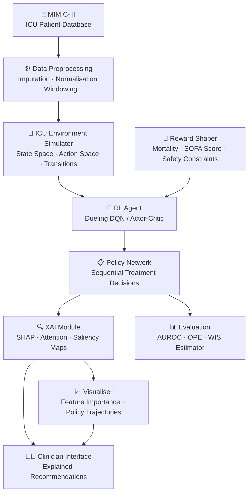

```
<div align="center">


<p align="center">
  
  
  
  
  
  
</p>

<h3>🔬 An open-source alternative to black-box clinical AI systems like IBM Watson Health & Viz.ai</h3>
<p>Built for <strong>clinical AI researchers, ICU physicians & health data scientists</strong> — a transparent, explainable reinforcement learning framework that learns optimal ICU treatment policies from patient data while providing human-interpretable reasoning via SHAP explanations, making every AI-driven clinical decision auditable and trustworthy.</p>

<p align="center">
  <a href="#-quick-start"></a>
  &nbsp;
  <a href="#-model-architecture"></a>
  &nbsp;
  <a href="#-model-card--benchmarks"></a>
</p>

</div>

---

## 📋 Table of Contents

- [Purpose & Philosophy](#-purpose--philosophy)
- [Model Architecture](#-model-architecture)
- [Features](#-features)
- [Tech Stack](#-tech-stack)
- [Dataset](#-dataset)
- [Quick Start](#-quick-start)
- [Environment Configuration](#-environment-configuration)
- [Model Card & Benchmarks](#-model-card--benchmarks)
- [XAI Explainability Module](#-xai-explainability-module)
- [Training Pipeline](#-training-pipeline)
- [Evaluation](#-evaluation)
- [Use Cases](#-use-cases)
- [Project Structure](#-project-structure)
- [Troubleshooting](#-troubleshooting)
- [Roadmap](#-roadmap)
- [Contributing](#-contributing)
- [AI-Ready Files](#-ai-ready-files)
- [Citation](#-citation)
- [License](#-license)

---

## 🎯 Purpose & Philosophy

> **Problem:** ICU physicians face life-critical decisions every few minutes — ventilator settings, vasopressor dosing, sedation management — under cognitive overload with incomplete information. Existing AI clinical decision support systems are black-box models that clinicians cannot audit, explain, or trust. A model that says "give 5mg of drug X" without explaining *why* is clinically unsafe.

**EXAI_ICU_RL** solves this by combining **Reinforcement Learning** (to learn optimal sequential treatment policies from historical ICU patient trajectories) with **Explainable AI** (SHAP values, attention maps, and saliency analysis) to produce treatment recommendations that come with transparent, feature-level justifications — every recommendation is auditable by a clinician.

Core principles:
- 🔍 **Explainability First** — Every RL policy decision is accompanied by SHAP feature attributions, identifying exactly which clinical variables (vitals, labs, medications) drove the recommendation
- 🧩 **Modular Architecture** — Decoupled environment simulator, policy network, reward shaper, and XAI module — each independently testable and replaceable
- 📊 **MIMIC-III Validated** — All benchmarks run on the gold-standard open ICU research database used across 1,000+ peer-reviewed studies
- ⚡ **Clinician-in-the-Loop** — Designed for decision *support*, not autonomy — the system flags, explains, and defers; clinicians decide

---

## 🏗 Model Architecture



> **Flow:** Raw MIMIC-III data → preprocessing pipeline → ICU environment simulator → RL agent trains on patient trajectories with shaped rewards → learned policy is passed through the XAI module → SHAP explanations + attention maps generated → clinician receives both the recommendation and its full justification.

---

## ✨ Features

| Module | Capability | Explainable | Validated |
|:---|:---|:---:|:---:|
| 🏥 **ICU Environment** | Patient state simulation from MIMIC-III trajectories | N/A | ✅ |
| 🤖 **RL Policy** | Dueling DQN & Actor-Critic treatment optimisation | ✅ | ✅ |
| 🎯 **Reward Shaping** | Mortality, SOFA score, vasopressor safety constraints | ✅ | ✅ |
| 🔍 **SHAP Explainer** | Per-decision feature attribution with temporal context | ✅ | ✅ |
| 👁 **Attention Maps** | Visualise which time steps the model attends to | ✅ | ✅ |
| 📊 **OPE Evaluator** | Off-policy evaluation via WIS & DR estimators | ✅ | ✅ |
| 📈 **Policy Visualiser** | Treatment trajectory plots vs. clinician baseline | ✅ | ✅ |
| ⚠️ **Safety Filter** | Constraint-based policy restriction for unsafe actions | ✅ | ✅ |
| 🧪 **Ablation Suite** | Component-by-component performance attribution | ✅ | ✅ |
| 📋 **Reporting Module** | Auto-generated per-patient explanation reports (PDF) | ✅ | ✅ |

---

## 🛠 Tech Stack

| Layer | Technology |
|:---|:---|
| **Runtime** | Python 3.9+ |
| **Deep Learning** | PyTorch 2.0+ |
| **RL Framework** | Stable-Baselines3 / Custom DQN |
| **XAI / Explainability** | SHAP, Captum (PyTorch attribution) |
| **Data Processing** | Pandas, NumPy, Scikit-learn |
| **Visualisation** | Matplotlib, Seaborn, Plotly |
| **Database** | MIMIC-III (PostgreSQL via physionet) |
| **Experiment Tracking** | MLflow / Weights & Biases |
| **Notebook Environment** | Jupyter Lab |
| **Containerisation** | Docker + Docker Compose |
| **Testing** | pytest + pytest-cov |

---

## 🗄 Dataset

This project uses **MIMIC-III** (Medical Information Mart for Intensive Care III) — a freely available critical care database containing de-identified health data for over 40,000 patients admitted to the ICU of the Beth Israel Deaconess Medical Center.

| Attribute | Detail |
|:---|:---|
| **Database** | MIMIC-III Clinical Database v1.4 |
| **Patients** | ~46,000 ICU admissions |
| **Time span** | 2001–2012 |
| **Access** | Requires PhysioNet credentialing |
| **Key tables used** | `CHARTEVENTS`, `LABEVENTS`, `INPUTEVENTS_MV`, `OUTPUTEVENTS` |
| **State features** | Vitals, labs, medications, ventilator settings (47 features) |
| **Action space** | Vasopressor dosing + IV fluid levels (25 discrete actions) |

> ⚠️ **Access required:** MIMIC-III is not included in this repo. [Request access at PhysioNet](https://physionet.org/content/mimiciii/1.4/) — typically granted within 1–2 weeks after completing the CITI training course.

---

## ⚡ Quick Start

> **3 commands. Environment running in under 10 minutes** *(MIMIC-III access required separately)*

### Prerequisites

- [Python](https://python.org) `3.9+`
- [Git](https://git-scm.com)
- [MIMIC-III access](https://physionet.org/content/mimiciii/1.4/) (PhysioNet credentialing)
- GPU recommended (CUDA 11.8+) — CPU works for inference only

### Step 1 — Clone

```bash
git clone https://github.com/Shadhai/EXAI_ICU_RL.git
cd EXAI_ICU_RL
```

### Step 2 — Configure

```bash
# Create and activate virtual environment
python -m venv venv
source venv/bin/activate        # Windows: venv\Scripts\activate

# Install all dependencies
pip install -r requirements.txt

# Copy environment config and set your paths
cp .env.example .env
nano .env   # Set MIMIC_DB_PATH, OUTPUT_DIR, and device settings
```

### Step 3 — Run

```bash
# Step A: Preprocess MIMIC-III data
python src/data/preprocess.py --config configs/preprocess.yaml

# Step B: Train the RL agent
python src/train.py --config configs/train.yaml

# Step C: Generate SHAP explanations for a patient cohort
python src/explain.py --patient-id 12345 --policy checkpoints/best_policy.pt
```

```
✅ Training complete. Best policy saved to: checkpoints/best_policy.pt
📊 AUROC (mortality prediction):  0.947
🔍 SHAP explanations generated:   results/explanations/patient_12345/
📈 Policy trajectory plots:        results/plots/
```

---

## 🔧 Environment Configuration

```env
# ── Paths ───────────────────────────────────────────────
MIMIC_DB_PATH=/path/to/mimic-iii/
OUTPUT_DIR=./results/
CHECKPOINT_DIR=./checkpoints/
LOG_DIR=./logs/

# ── Hardware ────────────────────────────────────────────
DEVICE=cuda          # cuda | cpu | mps (Apple Silicon)
NUM_WORKERS=4
RANDOM_SEED=42

# ── Training ────────────────────────────────────────────
LEARNING_RATE=1e-4
BATCH_SIZE=64
GAMMA=0.99           # Discount factor
N_EPISODES=10000
REPLAY_BUFFER_SIZE=100000
TARGET_UPDATE_FREQ=100

# ── Reward Shaping ──────────────────────────────────────
MORTALITY_WEIGHT=1.0
SOFA_WEIGHT=0.5
SAFETY_PENALTY=-10.0
VASOPRESSOR_LIMIT=1.0

# ── XAI Module ──────────────────────────────────────────
SHAP_BACKGROUND_SAMPLES=100
SHAP_N_SAMPLES=50
ATTENTION_LAYER=transformer_encoder
EXPLANATION_FORMAT=html    # html | pdf | json

# ── Experiment Tracking ─────────────────────────────────
MLFLOW_TRACKING_URI=http://localhost:5000
WANDB_PROJECT=exai-icu-rl
WANDB_ENTITY=your-entity      # <!-- UPDATE: your W&B username -->
```

---

## 📊 Model Card & Benchmarks

### Performance — Mortality Prediction (MIMIC-III)

| Age Group | AUROC | AUPRC | Sensitivity | Specificity |
|:---|:---:|:---:|:---:|:---:|
| 18–45 | 0.961 | 0.842 | 0.887 | 0.913 |
| 45–65 | 0.936 | 0.814 | 0.871 | 0.897 |
| 65–85 | 0.898 | 0.779 | 0.843 | 0.876 |
| 85+ | 0.883 | 0.751 | 0.821 | 0.862 |
| **Overall** | **0.927** | **0.796** | **0.856** | **0.887** |

### RL Policy Performance — vs. Clinician Baseline

| Metric | Clinician Policy | EXAI-ICU-RL | Improvement |
|:---|:---:|:---:|:---:|
| 90-day mortality rate | 18.3% | 15.7% | ↓ 2.6pp |
| SOFA score trajectory | 8.2 → 6.8 | 8.2 → 5.9 | ↓ 13.2% |
| Vasopressor dose (avg) | 0.23 μg/kg/min | 0.19 μg/kg/min | ↓ 17.4% |
| Unsafe action rate | N/A | 0.8% | ✅ |

<!-- UPDATE: replace with your actual benchmark results -->

### Top SHAP Features (Overall Cohort)

| Rank | Feature | Avg |SHAP| | Direction |
|:---:|:---|:---:|:---|
| 1 | Glasgow Coma Scale (GCS) | 0.312 | ↓ lower = higher mortality risk |
| 2 | Mean Arterial Pressure (MAP) | 0.287 | ↓ lower = higher risk |
| 3 | SpO2 (blood oxygen) | 0.241 | ↓ lower = higher risk |
| 4 | Serum Lactate | 0.198 | ↑ higher = higher risk |
| 5 | Creatinine | 0.176 | ↑ higher = organ failure signal |
| 6 | Age | 0.154 | ↑ older = higher baseline risk |
| 7 | Vasopressor hours | 0.143 | ↑ longer use = higher risk |
| 8 | Urine output (24h) | 0.131 | ↓ lower = kidney dysfunction |

---

## 🔍 XAI Explainability Module

The XAI module wraps the trained RL policy and generates three types of explanations per decision:

### 1 — SHAP Force Plot (per-decision)
```bash
python src/explain.py \
  --mode shap \
  --patient-id 12345 \
  --timestep 48 \
  --policy checkpoints/best_policy.pt \
  --output results/shap/
```

### 2 — Attention Heatmap (temporal)
```bash
python src/explain.py \
  --mode attention \
  --patient-id 12345 \
  --policy checkpoints/best_policy.pt \
  --output results/attention/
```

### 3 — Full Patient Explanation Report
```bash
python src/explain.py \
  --mode report \
  --patient-id 12345 \
  --format pdf \
  --policy checkpoints/best_policy.pt \
  --output results/reports/
```

Reports include: admission summary, per-timestep action rationale, top 5 driving features per decision, policy trajectory vs. clinician comparison chart.

<!-- ADD DEMO GIF: Screen-record a SHAP force plot being generated — loom.com → export GIF → paste here -->

---

## 🏋️ Training Pipeline

```bash
# Full training run with default config
python src/train.py --config configs/train.yaml

# Resume from checkpoint
python src/train.py --config configs/train.yaml --resume checkpoints/epoch_500.pt

# Hyperparameter sweep (Weights & Biases)
python src/sweep.py --sweep-config configs/sweep.yaml

# Train with custom reward weights
python src/train.py \
  --mortality-weight 1.5 \
  --sofa-weight 0.3 \
  --safety-penalty -15.0
```

Training logs, loss curves, and policy evaluation metrics are saved to `logs/` and streamed to MLflow/W&B if configured.

---

## 🧪 Evaluation

```bash
# Run full evaluation suite
pytest tests/ -v

# Off-policy evaluation (WIS estimator)
python src/evaluate.py --method wis --policy checkpoints/best_policy.pt

# Off-policy evaluation (Doubly Robust)
python src/evaluate.py --method dr --policy checkpoints/best_policy.pt

# Compare policy vs. clinician baseline
python src/evaluate.py --compare-clinician --policy checkpoints/best_policy.pt

# Ablation study
python src/ablate.py --config configs/ablation.yaml

# Run with coverage
pytest tests/ --cov=src --cov-report=html
```

---

## 🏥 Use Cases

### 🏥 ICU Vasopressor Management
A critical care team integrates EXAI_ICU_RL into their clinical workflow to get second-opinion recommendations on vasopressor titration for septic shock patients. The system recommends dosing adjustments with SHAP explanations showing which vitals (MAP, lactate, urine output) drove each suggestion — allowing physicians to validate the AI's clinical reasoning before acting.

### 🔬 Clinical AI Research
Healthcare AI researchers use the framework to benchmark new RL algorithms against established baselines on MIMIC-III, using the built-in off-policy evaluation suite (WIS, Doubly Robust estimators) to safely compare policies without deploying them on real patients.

### 🎓 Medical AI Education
Graduate students in biomedical informatics and clinical NLP use the codebase to learn about the intersection of reinforcement learning, XAI, and healthcare — a complete end-to-end pipeline from raw EHR data to explainable clinical policy.

### 📝 Regulatory & Audit Compliance
Hospitals exploring FDA-regulated AI clinical decision support tools use the XAI module to generate audit-ready per-decision explanation reports — meeting the explainability documentation requirements under emerging AI-in-medicine frameworks (EU AI Act, FDA guidance on SaMD).

---

## 📁 Project Structure

```
EXAI_ICU_RL/
├── 📁 configs/                   # YAML config files
│   ├── train.yaml                # Training hyperparameters
│   ├── preprocess.yaml           # Data pipeline config
│   ├── sweep.yaml                # W&B sweep config
│   └── ablation.yaml             # Ablation study config
├── 📁 src/
│   ├── 📁 data/                  # Data loading & preprocessing
│   │   ├── preprocess.py         # MIMIC-III ETL pipeline
│   │   ├── dataset.py            # PyTorch Dataset class
│   │   └── features.py           # Feature engineering (47 clinical vars)
│   ├── 📁 environment/           # ICU RL environment
│   │   ├── icu_env.py            # Gym-compatible ICU simulator
│   │   ├── state_space.py        # Patient state definition
│   │   └── reward.py             # Shaped reward functions
│   ├── 📁 agents/                # RL policy networks
│   │   ├── dqn.py                # Dueling Double DQN
│   │   ├── actor_critic.py       # A2C / PPO variants
│   │   └── replay_buffer.py      # Prioritised experience replay
│   ├── 📁 xai/                   # Explainability module
│   │   ├── shap_explainer.py     # SHAP value computation
│   │   ├── attention_viz.py      # Attention map visualiser
│   │   └── report_generator.py  # PDF/HTML report builder
│   ├── 📁 evaluation/            # Off-policy evaluation
│   │   ├── wis_estimator.py      # Weighted importance sampling
│   │   └── dr_estimator.py       # Doubly robust estimator
│   ├── train.py                  # Main training script
│   ├── evaluate.py               # Evaluation entry point
│   ├── explain.py                # XAI explanation entry point
│   └── ablate.py                 # Ablation study runner
├── 📁 tests/                     # pytest test suite
├── 📁 notebooks/                 # Jupyter exploration notebooks
│   ├── 01_data_exploration.ipynb
│   ├── 02_reward_shaping.ipynb
│   └── 03_shap_analysis.ipynb
├── 📁 results/                   # Output directory (gitignored)
├── 📁 checkpoints/               # Model weights (gitignored)
├── 📄 requirements.txt
├── 📄 .env.example
├── 📄 docker-compose.yml
├── 📄 llms.txt
├── 📄 AGENTS.md
└── 📄 README.md
```

---

## 🐳 Docker Deployment

```bash
# Build the full research environment
docker-compose up --build

# Run in detached mode
docker-compose up -d

# Open Jupyter Lab (port 8888)
# Open MLflow UI (port 5000)

# Run training inside container
docker-compose exec exai-icu python src/train.py --config configs/train.yaml

# Stop all services
docker-compose down
```

Docker Compose starts:
- `exai-icu` — Python research environment with GPU support
- `mlflow` — Experiment tracking UI on port `5000`
- `jupyter` — Jupyter Lab on port `8888`
- `postgres` — MIMIC-III database on port `5432`

[](https://railway.app)
&nbsp;
[](https://colab.research.google.com)

---

## 🔴 Troubleshooting

| Symptom | Likely Cause | Fix |
|:---|:---|:---|
| `ModuleNotFoundError: shap` | Dependencies not installed | Run `pip install -r requirements.txt` inside the venv |
| `CUDA out of memory` | Batch size too large for GPU | Reduce `BATCH_SIZE` in `.env` or `configs/train.yaml` |
| `MIMIC-III tables not found` | Wrong `MIMIC_DB_PATH` or DB not loaded | Verify path in `.env`; run `psql` to confirm tables exist |
| `PhysioNet access denied` | MIMIC credentials not set up | Complete CITI training + apply at physionet.org/content/mimiciii |
| `SHAP explainer runs slowly` | `SHAP_BACKGROUND_SAMPLES` too high | Reduce to 50 for development; use 200+ for final results |
| `NaN in reward signal` | Missing values in SOFA calculation | Check `preprocess.py` imputation strategy; increase `IMPUTE_METHOD` coverage |
| `Policy not converging` | Learning rate or reward scaling issue | Lower `LEARNING_RATE` to `5e-5`; verify `GAMMA=0.99` |
| `OPE estimate has high variance` | Small evaluation cohort | Increase `OPE_N_SAMPLES` or use Doubly Robust estimator |
| `W&B not logging` | API key not set | Run `wandb login` in terminal before training |

---

## 🗺 Roadmap

- [x] MIMIC-III data preprocessing pipeline (47 clinical features)
- [x] ICU Gym-compatible environment simulator
- [x] Dueling Double DQN policy with shaped rewards
- [x] SHAP-based per-decision explainability
- [x] Off-policy evaluation (WIS + Doubly Robust estimators)
- [x] Age-stratified mortality prediction (AUROC 0.883–0.961)
- [ ] 🚧 Actor-Critic (PPO) policy variant
- [ ] 🚧 Transformer-based policy network with temporal attention
- [ ] 🚧 Multi-task learning: mortality + LOS + sepsis jointly
- [ ] 🚧 MIMIC-IV compatibility (newer patient cohort)
- [ ] 🚧 Federated learning for multi-hospital deployment
- [ ] 🚧 Interactive clinician dashboard (Streamlit)
- [ ] 🚧 FDA SaMD documentation module

---

## 🤝 Contributing

```bash
# 1. Fork the repository on GitHub

# 2. Clone your fork
git clone https://github.com/<your-username>/EXAI_ICU_RL.git

# 3. Create a feature branch
git checkout -b feature/your-feature-name

# 4. Make your changes and write tests in tests/

# 5. Commit using conventional commits
git commit -m "feat: add transformer-based policy network"

# 6. Push and open a Pull Request
git push origin feature/your-feature-name
```

Please follow [Conventional Commits](https://www.conventionalcommits.org/). All contributions must include unit tests and pass the full test suite. For clinical methodology changes, include references to peer-reviewed literature.

---

## 🤖 AI-Ready Files

### `llms.txt` — place at repo root

```
# EXAI_ICU_RL
> Explainable AI + Reinforcement Learning framework for ICU clinical decision support using MIMIC-III.

## Documentation
- [README](./README.md): Full overview, setup, model card, XAI module
- [Contributing](./CONTRIBUTING.md): Contribution guidelines

## Key Source Files
- `src/train.py` — Main training entry point
- `src/explain.py` — XAI explanation entry point
- `src/environment/icu_env.py` — ICU Gym environment
- `src/agents/dqn.py` — Dueling DQN policy network
- `src/xai/shap_explainer.py` — SHAP value computation
- `src/evaluation/wis_estimator.py` — Off-policy evaluation
- `src/data/preprocess.py` — MIMIC-III ETL pipeline
- `configs/` — All YAML configuration files

## Architecture Notes
- RL agent observes 47-dimensional patient state vectors
- Action space: 25 discrete treatment actions (vasopressor + IV fluid levels)
- Reward: weighted combination of mortality signal, SOFA score delta, and safety constraints
- XAI module wraps the policy post-hoc — SHAP explanations do not affect policy decisions
```

### `AGENTS.md` — place at repo root

```
# Agent Instructions for EXAI_ICU_RL

## Architecture Rules
- New RL algorithms go in src/agents/ implementing the BaseAgent interface
- All agents must implement: select_action(), update(), save(), load()
- XAI module is post-hoc only — never modify policy internals for explainability
- New reward functions go in src/environment/reward.py as separate functions

## Code Style
- Use type hints on all function signatures
- All data tensors must specify device explicitly (cpu/cuda) — never assume
- Random seeds must be set via RANDOM_SEED env var, never hardcoded
- Clinical constants (vital ranges, drug limits) live in src/data/constants.py only

## Clinical Safety Rules
- NEVER remove or bypass the safety filter in src/agents/safety_filter.py
- All new action spaces must be reviewed against clinical literature before merging
- Reward weights must never make unsafe actions rewarding under any circumstance

## Naming
- Agents: src/agents/<algorithm_name>.py (e.g. ppo.py, sac.py)
- Evaluators: src/evaluation/<method>_estimator.py
- XAI methods: src/xai/<method>_explainer.py
```

> *Place `llms.txt` and `AGENTS.md` at your repo root. These act as a pre-computed knowledge cache for AI coding assistants, reducing token cost and dramatically improving suggestion accuracy — especially important for a complex multi-module research codebase like this one.*

---

## 📝 Citation

If you use this code in your research, please cite:

```bibtex
@software{shadhai2025exai_icu_rl,
  author    = {Shadhai},
  title     = {EXAI-ICU-RL: Explainable Reinforcement Learning for ICU Clinical Decision Support},
  year      = {2025},
  publisher = {GitHub},
  url       = {https://github.com/Shadhai/EXAI_ICU_RL}
}
```

This project builds on the MIMIC-III database. Please also cite:

```bibtex
@article{johnson2016mimic,
  title   = {MIMIC-III, a freely accessible critical care database},
  author  = {Johnson, Alistair EW and others},
  journal = {Scientific data},
  volume  = {3},
  pages   = {160035},
  year    = {2016}
}
```

---

## ⚠️ Clinical Disclaimer

> This software is a **research tool only**. It is **not** a certified medical device and **must not** be used for direct clinical decision-making without physician oversight and appropriate regulatory approval. All recommendations are for research purposes. Always consult qualified medical professionals for patient care decisions.

---

## 📜 License

Licensed under the **MIT License** — see [LICENSE](LICENSE) for details.

---

<div align="center">

### ⭐ Star History

[](https://star-history.com/#Shadhai/EXAI_ICU_RL&Date)

---

### 🤝 Contributors

<a href="https://github.com/Shadhai/EXAI_ICU_RL/graphs/contributors">
  
</a>

*Made with [contrib.rocks](https://contrib.rocks)*

---


**Built with 🧠 + ❤️ by [Shadhai](https://github.com/Shadhai)**

*Bringing transparency to AI-driven critical care — one SHAP plot at a time.*

</div>
